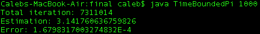
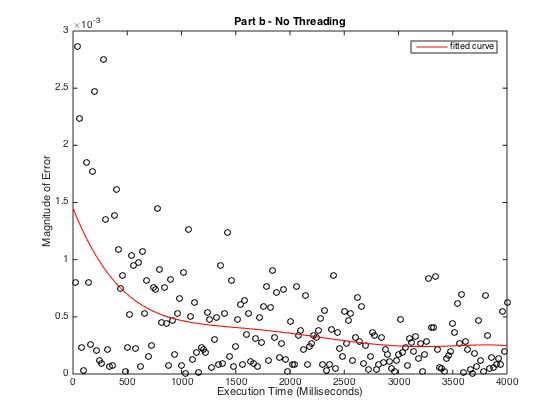
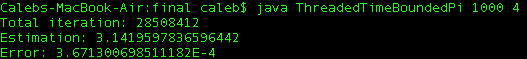
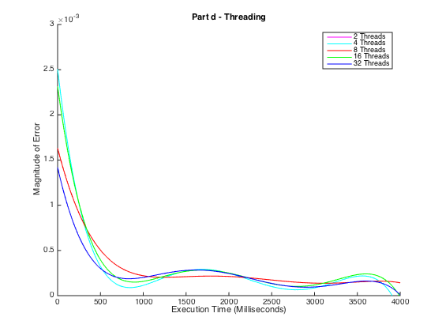

####Threading in Java, explored with a Monte Carlo Simulation 
_______________

This project explores threading in java by running a [Monte Carlo Simulation](http://en.wikipedia.org/wiki/Monte_Carlo_method) to estimate Pi. Given a unit circle inside a unit sqaure, the chance that any randomly generated point falls within the circle should be Pi. The more random points that are generated, the better the estimation should be. Threading should allow us to approach a more accurate result quicker.

####(A) Time Bounded Simulation (Single Threaded)

This implementation does not use concurrency to calculate Pi. It is to be used as a comparison to the concurrent model.

Implementation:

[TimeBoundedPi.java](TimeBoundedPi.java)

Usage:

`java TimeBoundedPi <Time in Milliseconds>`

Sample Output: 

####(B) Graphing the Data

It is clear that the more time the simulation has to run, the more accurate the result becomes.

####(C) Threading the Simulation

This implementation creates n number of threads that will run simultaneously. The threads are all started at the same time, and the main function is specified to wait for each to finish. Each thread is an object with member variables that are used to return the data needed. Once each thread rejoins, the member variables are accessed, and their data is pooled and used to calculate the estimate of PI.

Implementation: 

[ThreadedTimeBoundedPi.java](ThreadedTimeBoundedPi.java)

Usage:

`java ThreadedTimeBoundedPi <Time in Milliseconds> <Number of Threads>`

Sample Output: 

####(D) Graphing the Threaded Data

First, it is clear that all of these options provide a performance increase over a single threaded method, which provided an error of approximately 0.4 - 0.5 consistently.

Four threads is the optimal number to be used for performance. It has the lowest average error and after approximately 4 seconds, the error stays much closer to 0 than the other thread counts.

This is more that likely due to the fact that we are using 4 cored cpu's. This allows exactly 4 process's to be run at nearly 100% cpu capacity simultaneously. It is the closest that this concurrent setup will be to a truly parallel model.